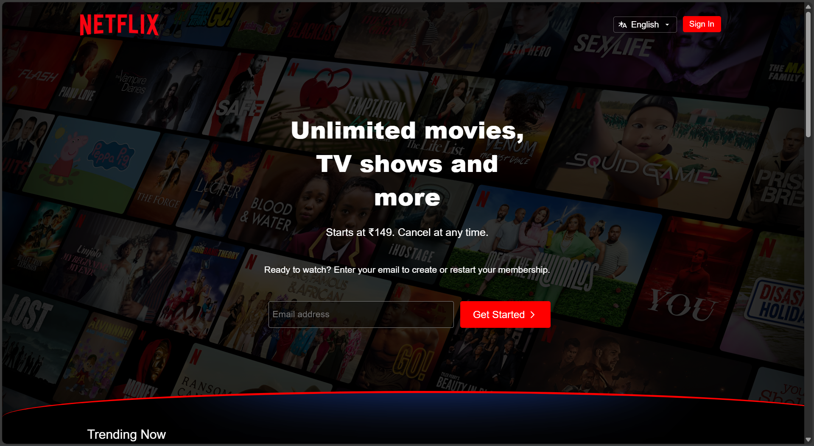

# Netflix Landing Page Clone

This is a **Netflix landing page clone** built using only **HTML and CSS**. It replicates the look and feel of the original Netflix homepage, focusing on layout, design, and responsiveness.

## 🔍 Features

- Fully responsive layout
- Styled with pure CSS (no frameworks)
- Visual clone of the Netflix homepage

## 📸 Preview

 

## 🚀 Getting Started

1. Clone the repository:
   ```bash
   git clone https://github.com/Tusharmgs/netflix-landing-page-clone.git

netflix-landing-page/
│
├── index.html         # Main HTML file
├── style.css          # Main CSS file
└── README.md          # Project documentation

🛠️ Tech Stack
HTML5

CSS3

📬 Contact
If you're also learning frontend or working on something similar, feel free to connect with me on [LinkedIn](https://www.linkedin.com/in/tushar-keshari-53315933b?utm_source=share&utm_campaign=share_via&utm_content=profile&utm_medium=android_app)  or drop a message!


